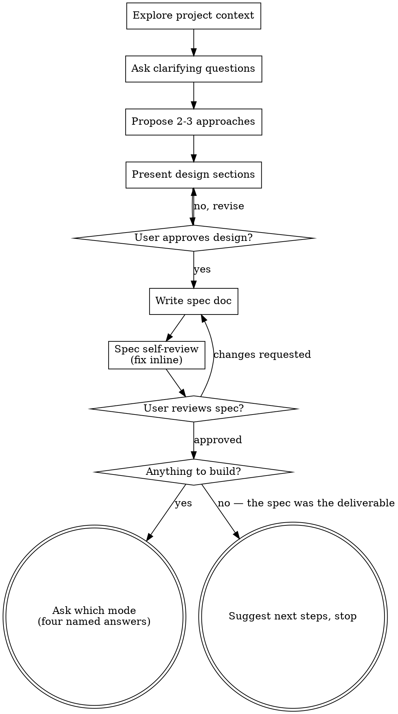

# Brainstorming Ideas Into Designs

Help turn ideas into fully formed designs and specs through natural collaborative dialogue.

Start by understanding the current project context, then ask questions one at a time to refine the idea. Once you understand what you're building, present the design and get user approval.

<HARD-GATE>
Do NOT invoke any implementation skill, write any code, scaffold any project, or take any implementation action until you have presented a design and the user has approved it. This applies to EVERY project regardless of perceived simplicity.
</HARD-GATE>

## Anti-Pattern: "This Is Too Simple To Need A Design"

Triage already decided this ask was worth designing — don't re-litigate it here.
**Every ask goes through every step below**, and the two excuses for skipping
them are both wrong:

- **"It's simple."** Simple is where unexamined assumptions cause the most
  wasted work.
- **"It's already well-specified."** A ticket, an issue, or a written brief
  pins down *what* to build. It is not an answer to *how*, *at what cost*, *what
  it breaks*, or *should we*. Those are what the questions and the alternatives
  are for, and a precise ticket makes them easier to answer, not unnecessary.

The design can be short — a few sentences for a small change — but you MUST
present it and get approval.

## Checklist

You MUST complete these in order.

1. **Explore project context** — check files, docs, recent commits
2. **Offer the visual companion just-in-time** — NOT upfront. The first time a question would genuinely be clearer shown than described, offer it then (its own message); on approval, start the companion and the user's browser opens to it. If no visual question ever arises, never offer it. See the Visual Companion section below.
3. **Ask clarifying questions** — one at a time, understand purpose/constraints/success criteria
4. **Propose 2-3 approaches** — with trade-offs and your recommendation
5. **Present design** — in sections scaled to their complexity, get user approval after each section
6. **Write the spec** — to `docs/specs/`, by default always. Self-review it, then ask the user to review it (see below)
7. **Ask which mode** — one `AskUserQuestion` call, the four modes from the session bootstrap. Not a yes/no on a mode you already picked

**Every gate here is a question you ask.** Steps 3, 4, 5 and 7 each end with the
user answering something. The failure mode is converting one into an
announcement with a window to object, which reads as decisive and skips the step:

| Step | What the skipped version looks like |
|---|---|
| 3 · clarifying questions | "No clarifying questions needed — the ticket settles it." |
| 4 · two or three approaches | "Decisions I'm making (flag if you disagree): …" |
| 5 · design, section by section | the whole design in one block, ending "does this look right?" |
| 7 · which mode | "Shall I proceed?" — a yes/no on the mode you already chose |

If you have written one of these, the step did not happen. Go back and ask.

## Process Flow



**The terminal state is a question you ask out loud.** The spec gets written, and then the user picks a mode. Reading the mode table is not the step — asking is. Do NOT invoke an implementation skill, and do not start building, before the user has answered.

If the user already said where the work happens — a worktree, a branch, a repo — that is not an answer to this question. It settles *where*, not *which mode*, and not the gates.

## The Process

**Understanding the idea:**

- Check out the current project state first (files, docs, recent commits)
- Before asking detailed questions, assess scope: if the request describes multiple independent subsystems (e.g., "build a platform with chat, file storage, billing, and analytics"), flag this immediately. Don't spend questions refining details of a project that needs to be decomposed first.
- If the project is too large for a single spec, help the user decompose into sub-projects: what are the independent pieces, how do they relate, what order should they be built? Then brainstorm the first sub-project through the normal design flow. Each sub-project gets its own spec → plan → implementation cycle.
- For appropriately-scoped projects, ask questions one at a time to refine the idea
- Prefer multiple choice questions when possible, but open-ended is fine too
- Only one question per message - if a topic needs more exploration, break it into multiple questions
- Focus on understanding: purpose, constraints, success criteria

**Exploring approaches:**

- Propose 2-3 different approaches with trade-offs
- Present options conversationally with your recommendation and reasoning
- Lead with your recommended option and explain why
- YAGNI ruthlessly - remove unnecessary features from every approach and design

**Presenting the design:**

- Once you believe you understand what you're building, present the design
- Scale each section to its complexity: a few sentences if straightforward, up to 200-300 words if nuanced
- Ask after each section whether it looks right so far
- Cover what the thing actually has. For software: architecture, components, data flow, error handling, testing. For anything else, the equivalent — the parts, how they fit together, what happens when it goes wrong
- Be ready to go back and clarify if something doesn't make sense

**When the work is software — design for isolation and clarity:**

- Break the system into smaller units that each have one clear purpose, communicate through well-defined interfaces, and can be understood and tested independently
- For each unit, you should be able to answer: what does it do, how do you use it, and what does it depend on?
- Can someone understand what a unit does without reading its internals? Can you change the internals without breaking consumers? If not, the boundaries need work.
- Smaller, well-bounded units are also easier for you to work with - you reason better about code you can hold in context at once, and your edits are more reliable when files are focused. When a file grows large, that's often a signal that it's doing too much.

**When the work is software — working in existing codebases:**

- Explore the current structure before proposing changes. Follow existing patterns.
- Where existing code has problems that affect the work (e.g., a file that's grown too large, unclear boundaries, tangled responsibilities), include targeted improvements as part of the design - the way a good developer improves code they're working in.
- Don't propose unrelated refactoring. Stay focused on what serves the current goal.

## After the Design

**Write the spec — by default, always:**

The spec is the durable record of what was decided and the input every mode
consumes: *vibe*, *review each task* and *review at the end* build from it,
*plan first* turns it into a plan, `/autopilot` takes it away and runs it.
Skip it only when the user says to.

- Write the validated design (spec) to `docs/specs/YYYY-MM-DD-<topic>-design.md`
  - A design document goes in `docs/specs/` even when the repo keeps other
    documents elsewhere. `docs/plans/` means "carries the executing-plans
    header" — a spec filed there will be read as a plan and found to be missing
    its tasks.
  - (An explicit user preference for spec location overrides this default. A
    convention you inferred from the repo does not.)
- Use a writing-clearly-and-concisely skill if available
- Commit the design document to git

**Every spec opens with this header**, so a session that opens it later knows a
choice is owed rather than assuming one:

```markdown
# [Topic] — Design

> **To act on this design:** pick a mode — *vibe* (inline, no machinery),
> *review each task* (per-task diffs), *review at the end* (one subagent
> builds, one review at the end), or *plan first* (`writing-plans`, then how it gets built).
> Unattended end-to-end is `/autopilot`. Ask the user which; don't pick for
> them.
```

**Spec Self-Review:**
After writing the spec document, look at it with fresh eyes:

1. **Placeholder scan:** Any "TBD", "TODO", incomplete sections, or vague requirements? Fix them.
2. **Internal consistency:** Do any sections contradict each other? Does the architecture match the feature descriptions?
3. **Scope check:** Is this focused enough for a single implementation plan, or does it need decomposition?
4. **Ambiguity check:** Could any requirement be interpreted two different ways? If so, pick one and make it explicit.

Fix any issues inline. No need to re-review — just fix and move on.

**User Review Gate:**
After the spec review loop passes, ask the user to review the written spec before proceeding:

> "Spec written and committed to `<path>`. Please review it and let me know if you want to make any changes before we go further."

Wait for the user's response. If they request changes, make them and re-run the spec review loop. Only proceed once the user approves.

**Ask which mode:**

One `AskUserQuestion` call, four named answers, taken from the session bootstrap:

| Mode | What it does |
|---|---|
| **Vibe** | inline, right now — no subagents, no ledger, no review; the user eyeballs the result |
| **Review each task** | `executing-plans` inline — one task at a time in this session; the user approves each diff and is the reviewer |
| **Review at the end** | `executing-plans` delegated from the spec — one subagent builds it all, an independent review at the end; the user sees the finished branch |
| **Plan first** | `writing-plans` produces a reviewable plan file, then asks how it gets built |

The option labels name review cadence and carry an effort parenthetical —
*(minutes, no safety net)* and up — and the descriptions carry the machinery;
the bootstrap's menu section holds the canonical wording, including the
question line that names the typed route: unattended end-to-end is
`/autopilot`, never a menu row — nobody discovers unattended from a list.

Those four names are the option labels. Everywhere else, say the action rather
than the name: "I'll write the plan first, then ask how you want it built".

Recommend one and say why; you know how big the work is and who will execute it.
The choice is the user's, and it is a choice — a tool call with four options, not
a sentence ending in "shall I proceed?".

If there is nothing to build — the design was an essay, a decision, a document —
the spec is the deliverable. Skip the menu and suggest what could come next.

## Visual Companion

A browser-based companion for showing mockups, diagrams, and visual options during brainstorming. Available as a tool — not a mode. Accepting the companion means it's available for questions that benefit from visual treatment; it does NOT mean every question goes through the browser.

**Offering the companion (just-in-time):** Do NOT offer it upfront. Wait until a question would genuinely be clearer shown than told — a real mockup / layout / diagram question, not merely a UI *topic*. The first time that happens, offer it then, as its own message:
> "This next part might be easier if I show you — I can put together mockups, diagrams, and comparisons in a browser tab as we go. It's still new and can be token-intensive. Want me to? I'll open it for you."

**This offer MUST be its own message.** Only the offer — no clarifying question, summary, or other content. Wait for the user's response. If they accept, start the server with `--open` so their browser opens to the first screen automatically. If they decline, continue text-only and don't offer again unless they raise it.

**Per-question decision:** Even after the user accepts, decide FOR EACH QUESTION whether to use the browser or the terminal. The test: **would the user understand this better by seeing it than reading it?**

- **Use the browser** for content that IS visual — mockups, wireframes, layout comparisons, architecture diagrams, side-by-side visual designs
- **Use the terminal** for content that is text — requirements questions, conceptual choices, tradeoff lists, A/B/C/D text options, scope decisions

A question about a UI topic is not automatically a visual question. "What does personality mean in this context?" is a conceptual question — use the terminal. "Which wizard layout works better?" is a visual question — use the browser.

If they agree to the companion, read the detailed guide before proceeding:
`skills/brainstorming/visual-companion.md`
