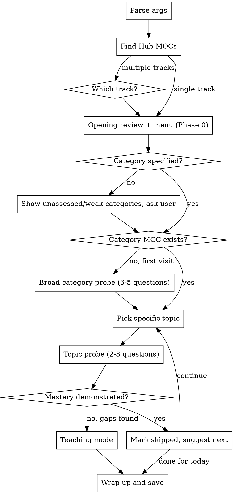

# Adaptive Learning Companion

## Overview

Interactive learning sessions that assess knowledge through conversation, teach where there are gaps, and create lasting reference notes in the notes root. Works with any learning track — not limited to programming.

## Defaults & Overrides

The skill reads and writes the locations below. A project may override any of
them in its CLAUDE.md (e.g. under a "Skill overrides: learn" heading) — the
defaults apply otherwise. The rest of this skill refers to them by name.

| Location | Default | Holds |
|----------|---------|-------|
| **Notes root** | `.learn/notes/` | Hub MOCs (at its root), track folders, `Glossary.md` |
| **State dir** | `.learn/` | `review-queue.md`, `progress.md` |
| **Templates** | `templates/` in this skill's directory | `hub-moc.md`, `category-moc.md`, `topic-note.md` |

Note conventions default to the bundled templates' style — wikilinks and
foldable callouts (Obsidian-flavored markdown; they degrade to plain
blockquotes elsewhere). Projects may also override link style, tag
conventions, and language.

## Structure

```
<notes root>/
├── <Track Name>.md                    ← Hub MOC (entry point for a learning track)
└── <Track Name>/
    └── <Category>/
        ├── <Category>.md              ← Category MOC
        └── <Topic>.md                 ← Topic notes
```

- **Hub MOC** — lists all categories with progress tables (Type: hub-moc)
- **Category MOC** — overview + topic table for one category (Type: category-moc)
- **Topic Note** — concept explanation + examples + end-of-chapter Q&A (Type: topic-note)
- **Templates** bundled in this skill's `templates/` directory (or the project's overridden location) define the format for each note type
- **Progress log** at `<state dir>/progress.md`
- **Review queue** at `<state dir>/review-queue.md` — spaced-recall items (see Phase 0)

## Session Flow



## Phase 0: Opening Review & Menu

Phase 0 always runs first: a **meanings review** (concept recall from
`review-queue.md`, "explain the idea" prompts), then a **menu** that lets the user
steer what comes next.

### Phase 0a: Meanings review (mandatory, first)

Lightweight spaced repetition layered onto `/learn`. Items are auto-captured during Teaching Mode (Phase 3) and quizzed here, at the start of the next session. **Run this after the track is selected (Phase 1, steps 1–3) and before category selection (Phase 1, step 4).**

**File:** `<state dir>/review-queue.md` — one markdown table, one row per recall question.

| Column | Meaning |
|--------|---------|
| `id` | Stable integer; on capture assign `max existing id + 1` (1 if the table is empty). |
| `track` | Hub MOC track name. |
| `topic` | Topic note the item came from. |
| `question` | The recall prompt. |
| `answer` | Terse memory-jog, not a full explanation — depth lives in the topic note. |
| `created` | ISO date (YYYY-MM-DD) captured. |
| `reviewed` | ISO date last graded (= `created` if never reviewed). Drives elapsed-time scheduling. |
| `due` | ISO date next due. |
| `interval` | Current interval in days. |
| `streak` | Consecutive "got it" count. |

**Quiz flow:** Select the batch with the helper script — it reads the queue, finds all
rows where `due <= today`, **shuffles them**, and returns up to 5 (randomizing the whole
due set keeps same-topic items, created together with the same `due`, from clustering and
leaking each other's answers):

```
node <skill dir>/select-due.mjs <state dir>/review-queue.md 5 <today>
```

`<skill dir>` is this skill's base directory, which is provided when the skill loads.

It prints `DUE_TOTAL`, `SELECTED`, `REMAINING_AFTER` (use this to decide whether the
Phase 0b "Continue meanings review" option is live), then the selected rows verbatim. If
`SELECTED` is 0, skip this phase silently and proceed to Phase 1 step 4. Quiz the whole
batch in **one round-trip** — never one question per message:

1. Post **all selected questions in a single message**, numbered 1–N, each tagged with its
   topic. Ask the user to answer all of them in one reply, by number.
2. The user answers from memory in one message. A number left unanswered counts as missed
   (unless the user says they're still working through the list).
3. Reply with **one grading message** covering every item in order: for each number, reveal
   the saved answer and state **got it** or **missed it** with a one-line reason (e.g. "you
   had the idea but missed the word 'transitive' — that's a miss"). Do **not** ask the user
   to confirm; grade all items and move on.
4. Grades stand unless the user overrides them — "override 3" (or flipping any number)
   works anytime; the final grade is always the user's if they speak up.

**Scheduling:** interval ladder `1 → 3 → 7 → 16 → 35 → 90 → 180 → 365` days (stays at 365 thereafter).

Schedule from the time the user **actually survived**, not from the stored interval:

```
elapsed = today − reviewed          (fall back to due − interval if `reviewed` is missing)
```

- **Got it** → `interval` = the first ladder rung **strictly greater than** `elapsed`; `streak += 1`.
- **Missed it** → `interval` = two rungs below the current one (floor `1`); `streak = 0`.
- Either grade → `reviewed = today`, `due = today + interval`.

Why elapsed rather than the ladder alone: a review is always late by some amount, and a
correct answer after a long gap is evidence of *that* gap's retention. Crediting only one
rung means a card 50 days overdue at `interval = 1` gets promoted to 3 days and comes
straight back — so an absence permanently inflates the due pile with material the user
demonstrably knows. Scheduling off `elapsed` drains the backlog instead of recycling it.
Symmetrically, a miss on a long-overdue card is not a failed short interval, so it steps
down gently instead of resetting to 1.

After grading every item, write the updated `reviewed`/`due`/`interval`/`streak` values
back to the table.

**Recommend notes to re-read (always, after any review).** Once grading is written back — and before continuing — tally the session's results **by topic note** (the `topic` column maps to a note at `<notes root>/<Track>/<Category>/<Topic>.md`). Then recommend which topic notes the user should re-read, in priority order:

- Rank topics by **miss rate this session** (misses ÷ items quizzed for that topic), most-missed first.
- For each recommended note, give the `[[wikilink]]` and the full path, and name the *specific sections* to re-read — derive these from the questions actually missed, not the whole note. Tell them what to skip if part of the note is already solid.
- Call out topics with **0 misses** as "skip — solid right now" so the user knows what *not* to spend time on.
- Pure-trivia misses (dates, names) are worth flagging as low-priority, not study targets.
- If nothing was missed, say so plainly — no re-read needed — and skip the ranking.

Then continue to **Phase 0b**.

### Phase 0b: Menu

After meanings review (or immediately, if nothing was due), ask the user: **"What now?"**
Present only the options that have something to do, plus Continue always:

1. **Continue meanings review** — *offer only if more `review-queue.md` items are still
   due* (beyond the batch of 5 already shown). Runs the next batch of 5 (Phase 0a flow),
   then returns to this menu.
2. **Continue with learning** — always offered. Exits the menu and proceeds to Phase 1
   step 4 (category selection).

After option 1 finishes, **re-present this menu** (recompute which options are live).
Option 2, or the user saying they're done, exits the loop. If at session start nothing is
due, present the menu with only option 2 live and flow straight into it.

## Phase 1: Load Context

1. **Discover tracks** — Glob for `<notes root>/*.md` files with `Type: hub-moc` in frontmatter. These are the available learning tracks.
2. **Select track:**
   - If only one hub MOC exists → use it
   - If multiple → ask user which track (or match from args, e.g. `/learn full-stack databases`)
   - If none → ask user if they want to create a new learning track
3. **Read the Hub MOC** — parse all category tables. Note status of each topic: `—` (unassessed), `⏭️ skipped`, or a skill level (`beginner`/`intermediate`/`advanced`)

> **Now run [Phase 0: Opening Review & Menu](#phase-0-opening-review--menu)** — meanings review, then the menu (continue the review / continue with learning). Return here at Phase 1 step 4 only when the user picks "Continue with learning".

4. **Select category:**
   - If category specified in args (e.g. `/learn databases`) → match to category name (case-insensitive, partial match OK)
   - If no category specified → present categories with unassessed or weak topics, ask user to pick

When presenting options, show a compact summary:
```
Backend & Infrastructure: 6 topics (0 assessed)
Frontend: 5 topics (0 assessed)
...
```

## Phase 2: Category Assessment

**First visit to a category** (no category MOC exists yet):

Start with 3-5 broad probing questions that span the category. These should be practical and applied:

- "How would you design..." not "What is the definition of..."
- "What happens when..." not "Name three types of..."
- "Walk me through..." not "List the steps to..."

Based on answers, identify which specific topics the user is strong in and which have gaps. This determines where to focus.

**Return visit** (category MOC exists):

Read the category MOC. Pick the next unassessed or weakest topic.

## Phase 3: Topic Deep-Dive

Ask 2-3 probing questions on the specific topic. Gauge the response:

**If mastery demonstrated:**
- Tell the user they're solid on this
- Mark as `⏭️ skipped` in the Hub MOC table
- Ask if they want to continue to the next topic or stop

**If gaps found — enter Teaching Mode:**

Teaching mode is a dialogue, not a lecture:

1. **Identify the edge** — ask follow-up questions to find exactly where understanding breaks down
2. **Explain the concept** — use analogies, real-world examples, diagrams-in-text. Explain WHY, not just WHAT
3. **Give practical examples** — code snippets, architecture diagrams, real scenarios
4. **Verify understanding** — ask a question that requires applying what was just taught
5. **Go deeper if needed** — repeat until the topic is well covered

**Capture for review (automatic).** While teaching, silently note anything worth re-testing later, sorting each into one of two buckets — do not interrupt the dialogue or ask the user to confirm; hold them and write them out at Wrap Up (Phase 4):

- **Forgotten term / naming** (the user knew the idea but couldn't summon the *word*) → a **glossary** item: the `term`, a crisp ≤18-word `definition`, and the `source` topic note. Goes to `Glossary.md` only — it is a lookup reference, nothing quizzes it.
- **Concept gap** (a struggled-with idea or something taught from scratch) → a **meanings** item: a short recall `question` and terse `answer`. Goes to `review-queue.md`.

See Phase 0 for the review-queue schema.

Stay conversational. This is a dialogue between colleagues, not a classroom lecture.

## Phase 4: Wrap Up and Save

After the session (user says they're done, or natural stopping point):

### Determine paths

The track name from the Hub MOC determines all paths:
- Category folder: `<notes root>/<Track Name>/<Category>/`
- Category MOC: `<notes root>/<Track Name>/<Category>/<Category>.md`
- Topic note: `<notes root>/<Track Name>/<Category>/<Topic>.md`

### Create/update notes

1. **Category folder** — create if it doesn't exist
2. **Category MOC** — create or update using the `category-moc` template (see Defaults & Overrides) as base format:
   - List all topics discussed with their assessed skill levels
   - Add any resources or links that came up
3. **Topic notes** — for each topic where teaching happened, create using the `topic-note` template (see Defaults & Overrides):
   - Write clear concept explanations based on what was discussed
   - Include code examples and practical scenarios
   - Add Key Takeaways as bullet points
   - Add 3-5 end-of-chapter questions with foldable answers using `> [!faq]- Answer` syntax
   - Set `Skill-Level` in frontmatter based on assessment

### Update progress tracking

4. **Hub MOC** — update the status and Last Reviewed date for each topic covered
5. **Progress log** — append a row to `<state dir>/progress.md`:
   ```
   | 2026-03-11 | Databases | Normalization, Indexing | intermediate — good on 1NF-3NF, gaps in index optimization |
   ```

### Append review items

6. **Append captured items** — write out everything captured in Phase 3, by bucket. Skip a bucket if it was empty.
   - **Meanings → `<state dir>/review-queue.md`** — fill `track`, `topic`, `question`, `answer`; assign `id` = max existing id + 1 (1 if empty), `created` = today, `reviewed` = today, `due` = tomorrow, `interval` = `1`, `streak` = `0`.
   - **Glossary → `<notes root>/Glossary.md`** — add the term if absent (`term`, crisp `definition`, `[[source]]`, A–Z position). Reference only; no scheduling fields, nothing quizzes it.

### Present summary

7. Tell the user:
   - What was covered
   - Strengths identified
   - Gaps to work on
   - What was captured: how many meanings cards went to the review queue, and how many terms were added to `Glossary.md` for reference lookup
   - Recommended next topic/category

## Creating a New Learning Track

If the user wants to start a new track (not just a new category in an existing one):

1. Ask for the track name (e.g. "Leadership", "Machine Learning", "Music Theory")
2. Ask for the initial set of categories and topics — brainstorm together
3. Create the Hub MOC using the `hub-moc` template as base
4. The track folder and category notes are created lazily during sessions

## Skill Level Criteria

| Level | Meaning |
|-------|---------|
| `—` | Not yet assessed |
| `⏭️ skipped` | Demonstrated mastery in probing questions, no note needed |
| `beginner` | Significant gaps, needs foundational study |
| `intermediate` | Understands core concepts, gaps in advanced areas or practical application |
| `advanced` | Strong understanding, minor edges to refine |

## Behavioral Rules

- **Language:** Match the language of the Hub MOC. Default to English for new tracks.
- **Tone:** Conversational, between colleagues. Not a teacher lecturing a student.
- **Questions:** Practical and applied, never trivia. "How would you..." not "What is..."
- **Adaptiveness:** Don't ask 20 questions if 3 show mastery. Don't lecture on what the user already knows.
- **Honesty:** If the user's answer is wrong, say so clearly but respectfully. Don't hedge.
- **Lazy creation:** Never create folders, MOCs, or topic notes until there's actual content to put in them.
- **One topic at a time:** Don't try to cover an entire category in one session. Depth over breadth.
- **User controls pace:** Always check if they want to continue or stop. Respect "let's stop here."
